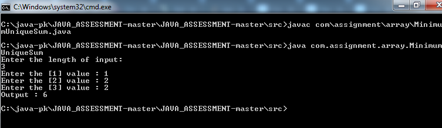
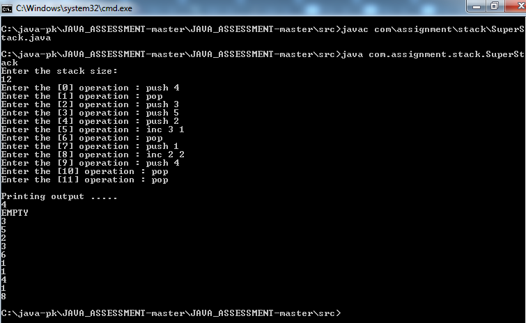
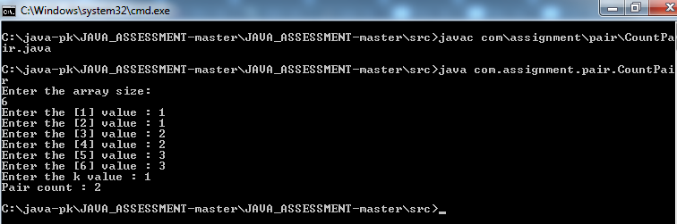

# Problem 1: Minimum Unique Array Sum

Given an array, you must increment any duplicate elements until all its elements are unique. In addition, the sum of its
elements must be the minimum possible within the rules. 
For example, 

if arr = [3, 2, 1, 2, 7], then arr = [3, 2, 1, 4, 7] and its elements sum to a minimal value of 3 + 2 + 1 + 4 + 7 = 17.

## Result:
```
Enter the length of input: 
3
Enter the [1] value : 1
Enter the [2] value : 2
Enter the [3] value : 2
Output : 6
```

##### Explanation:
Must increment any duplicate elements until all its elements are unique.

[1, 2, 3] - all elements are unique 

1 + 2 + 3 = 6

# Problem 2: Super Stack

Implement a simple stack that accepts the following commands and performs the operations associated with them:
push k : Push integer k onto the top of the stack.
pop : Pop the top element from the stack.
inc e k : Add k to each of the bottom e elements of the stack.

## Result:
```
Enter the stack size: 12
Enter the [0] operation : push 4
Enter the [1] operation : pop
Enter the [2] operation : push 3
Enter the [3] operation : push 5
Enter the [4] operation : push 2
Enter the [5] operation : inc 3 1
Enter the [6] operation : pop
Enter the [7] operation : push 1
Enter the [8] operation : inc 2 2
Enter the [9] operation : push 4
Enter the [10] operation : pop
Enter the [11] operation : pop

Printing output .....
4
EMPTY
3
5
2
3
6
1
1
4
1
8
```

# Problem 3: Counting Pairs

Two pairs of integers (a, b) and (c, d) are considered distinct if at least one element of (a, b) ∉ (c, d) . For example given a list
(1, 2, 2, 3), (1, 2) is distinct from (1, 3) and (2, 3) but not from (1, 2) with 2 chosen from a different index in the list. A pair is
valid if a ≤ b.

You will be given an integer k and a list of integers. Count the number of distinct valid pairs of integers (a, b) in the list for which a + k = b.

## Result:
```
Enter the array size: 
6
Enter the [1] value : 1
Enter the [2] value : 1
Enter the [3] value : 2
Enter the [4] value : 2
Enter the [5] value : 3
Enter the [6] value : 3
Enter the k value : 1
Pair count : 2
```

# How to Run the Program?
Java 8 is required as one of the program is uses java 8 stream feature.
Please make sure JDK 8 or above installed in your machine to run all the program without any issue.

1. Download or clone the git repository into your local.
2. If downloaded as zip file then extract the zip file in local file system.
3. Use command prompt and jump into the src folder.
4. Compile the programs using javac command.
4. Run the program using java command.

```
javac com\assignment\array\MinimumUniqueSum.java

java com.assignment.array.MinimumUniqueSum

```


```
javac com\assignment\stack\SuperStack.java

java com.assignment.stack.SuperStack

```


```
javac com\assignment\pair\CountPair.java

java com.assignment.pair.CountPair

```


